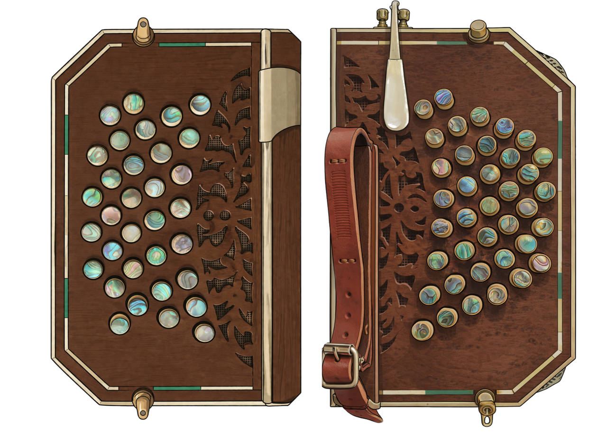

# Tango Bandoneon — MuseScore 4 Plugin

A MuseScore 4 plugin that displays an interactive bandoneon keyboard diagram, highlighting the buttons corresponding to the notes selected in the score.

---

## Features

- **Visual keyboard diagram** — Both bass (left hand) and treble (right hand) keyboards rendered over a photo of a real bandoneon, with buttons calibrated to match the physical layout.
- **Real-time note highlighting** — Buttons light up as you navigate the score. Supports single notes and chords.
- **Dual-clef mode** — Select any note and both keyboards update simultaneously: the treble keyboard shows the note in the G-clef staff, and the bass keyboard automatically shows the concurrent note in the F-clef staff (and vice versa).
- **Split mode** — Each keyboard responds only to its own staff's selection.
- **Bellows direction filter** — Filter highlighting by bellows direction:
  - ⊓ **Abriendo** (opening) — shows only buttons active while opening
  - ⊔ **Cerrando** (closing) — shows only buttons active while closing
  - **Sin filtro** — shows both directions simultaneously
- **Color coding:**
  - 🟡 Yellow — note active while opening
  - 🔴 Red — note active while closing
  - 🔵 Cyan — active in both directions
  - Transparent — button not active for current selection
- **Rheinische Tonlage** — Full 142-button layout (38 treble + 33 bass) based on the standard Argentine tango bandoneon tuning system.

---

## Requirements

- [MuseScore 4](https://musescore.org/) (tested on MS4)
- A score written for bandoneon with two staves (treble clef + bass clef)

---

## Installation

1. Download or clone this repository.
2. Copy the following files into your MuseScore plugins folder:
   - `TangoBandoneon.qml`
   - `teclados_recortado_balanceado.png`

   Default plugin folders:
   | OS | Path |
   |----|------|
   | Linux | `~/.local/share/MuseScore/MuseScore4/plugins/` |
   | macOS | `~/Library/Audio/Plug-Ins/MuseScore/MuseScore4/plugins/` |
   | Windows | `%APPDATA%\MuseScore\MuseScore4\plugins\` |

3. Open MuseScore 4, go to **Plugins → Manage Plugins**, and enable **Tango Bandoneon**.
4. Run it from **Plugins → Tango Bandoneon**.

> Both files must be in the same folder for the background image to load correctly.

---

## Usage

1. Open a bandoneon score in MuseScore.
2. Launch the plugin from the Plugins menu.
3. Click any note in the score — the corresponding buttons light up on both keyboards.
4. Use the **Modo** buttons to switch between:
   - **Dual (ambas claves)** — both keyboards update from the selected beat position
   - **Separado (por clave)** — each keyboard only responds to its own staff
5. Use the **Fuelle** buttons to filter by bellows direction.

---

## Tuning System

This plugin uses the **Rheinische Tonlage**, the standard system used for Argentine/Uruguayan tango bandoneons. 

| Side | Buttons | Clef |
|------|---------|------|
| Right hand (treble) | 38 | G clef (tracks 0–3) |
| Left hand (bass) | 33 | F clef (tracks 4+) |

Based on the original work by **Dave Ludlow** ([Bandoneon, 142 Button, Rheinische Tonlage](https://musescore.org/en/project/bandoneon-142-button-rheinische-tonlage)).

---

## Files

| File | Description |
|------|-------------|
| `TangoBandoneon.qml` | Main plugin file |
| `teclados_recortado_balanceado.png` | Background image of the bandoneon keyboards |

---

## License

- Original plugin © 2023 Dave Ludlow
- MuseScore 4 port and enhancements © 2026 Ignacio Irigaray

Released under the [GNU General Public License v3.0](https://www.gnu.org/licenses/gpl-3.0.en.html).
